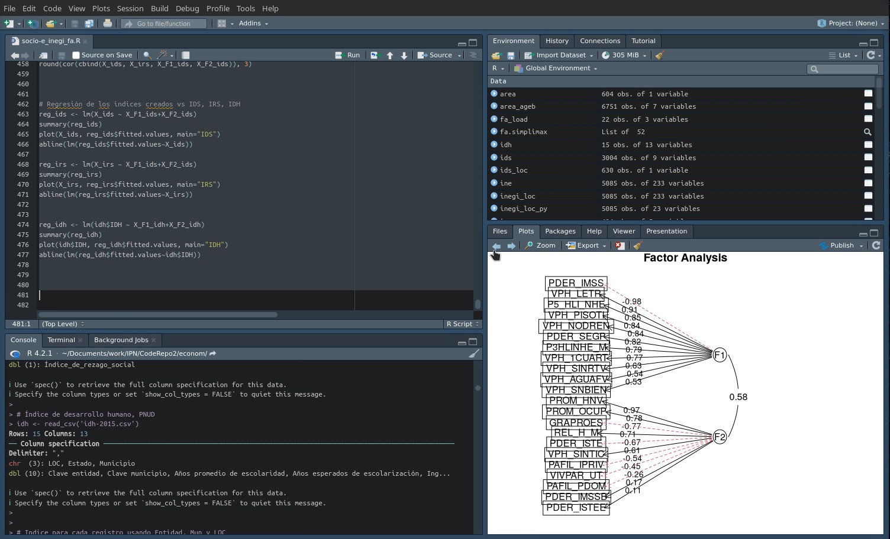

# Desarrollo de indicadores socioeconómicos para el análisis de datos de salud en la Ciudad de México
Los estudios han demostrado sistemáticamente que existe una relación entre un nivel socioeconómico (NSE)  bajo y una salud deficiente, por ejemplo tasas más elevadas de obesidad y diabetes. Los mecanismos exactos por los que el NSE influye en la salud son complejos y multidimensionales, pero pueden incluir factores como el estrés, la depresión, el acceso a alimentos sanos y atención médica, y la exposición a factores ambientales tóxicos.

Es importante crear indicadores de NSE para cuantificar con precisión y hacer un seguimiento de estos factores a lo largo del tiempo, por ejemplo, mediante Sistemas de Información Geográfica (SIG) que pueden utilizarse para analizar la distribución geográfica de estas características e identificar patrones y tendencias que puedan servir de base a las políticas e intervenciones de salud pública.

Sin embargo, el nivel socioeconómico (NSE) es un concepto complejo que engloba factores sociales y económicos altamente relacionados entre sí. Pero, el disponer de indicadores sociales y económicos separados, puede aportar información valiosa sobre los mecanismos específicos por los que la situación socioeconómica influye en la salud.

Por ejemplo, un estatus económico bajo puede indicar falta de acceso a alimentos sanos y atención médica, mientras que un estatus social bajo puede indicar mayor estrés y exposición a factores ambientales tóxicos. Por otro lado, un índice de estatus económico alto combinado con un índice de estatus social bajo podría indicar un grupo de individuos que disponen de recursos económicos pero carecen de apoyo social, afectando su salud.

Para evaluar el impacto de los factores socioeconómicos, se construyeron indicadores compuestos mediante un análisis factorial del Censo de Población y Vivienda 2020, utilizando aquellas variables que mostraron mayor relevancia en modelos predictivos de salud. Con estos indicadores se busca poder determinar las contribuciones relativas de los factores sociales y económicos, en diferentes modelos predictivos relacionados a la salud.

Los indicadores generados fueron validados al ser usados como predictores en un análisis de regresión para estimar el Índice de Rezago Social (IRS), el Índice de Desarrollo Social (IDS) y el Índice de Desarrollo Humano (IDH), obteniéndose coeficientes de determinación R^2>0.9, para todos ellos.

**Proyecto CONACyT**: Observatorio de datos para descubrimientos de patrones Sociales-EspacioTemporales en Salud, Movilidad y Calidad del Aire.

**Número**: 7051.

**Objetivo**: Definir las bases de interoperabilidad para homologar la información de las bases de datos de salud, y obtener datos precisos y confiables, que permitan tener series históricas y generar la trazabilidad de los pacientes, en especial de aquellos que padecen enfermedades crónicas no transmisibles, así como la construcción de indicadores de salud y su relación con la exposición a contaminantes atmosféricos. 

## Datos abiertos utilizados:
[Censo de Población y Vivienda 2020 (INEGI)](https://www.inegi.org.mx/programas/ccpv/2020/)

[Índice de Rezago Social (IRS) 2020 (CONEVAL)](https://www.coneval.org.mx/Medicion/IRS/Paginas/Indice_Rezago_Social_2020.aspx)

[Índice de Desarrollo Social de la Ciudad de México (Evalúa CDMX)](https://evalua.cdmx.gob.mx/principales-atribuciones/medicion-del-indice-de-desarrollo-social-de-las-unidades-territoriales/medicion-del-indice-de-desarrollo-social-de-las-unidades-territoriales)

[Índice de Desarrollo Humano Municipal 2015 (PNUD)](https://www.undp.org/es/mexico/publicaciones/idh-municipal-2010-2015)

## Uso
Ejecutar `Rscript socio-e_inegi_fa.R` ó cargar y ejecutar en RStudio.




## Requisitos
```
tidyverse==1.3.2
stringr==1.4.1
psych==2.2.9 
GPArotation==2022.10-2
car==3.1-1 
```

### Lista de archivos
[socio-e_inegi_fa.R](socio-e_inegi_fa.R): Código R/RStudio para generar los indicadores socioeconómicos.

[variables.pdf](variables.pdf): Variables relacionadas a modelos predictivos en salud, utilizadas para generar los indicadores.

[f_socio-e.pdf](f_socio-e.pdf): Resultado del análisis de factores, con los dos factores generados (social y económico).	

[ageb-area.csv](ageb-area.csv): Archivo generado por los autores, con estimaciones de superficie por localidad, usando QGIS.

[inegi_loc_py2.csv](inegi_loc_py2.csv): Archivo generado por los autores, con las variables del Censo de Población y Vivienda que resultaron relevantes en los modelos predictivos de salud. Los datos de vivienda y población se reescalaron utilizando el total de viviendas y población de cada localidad, respectivamente.

[inegi_loc.csv](inegi_loc.csv): Datos del Censo de Población y Vivienda 2020, INEGI.

[irs_cdmx.csv](irs_cdmx.csv): Datos del Índice de Rezago Social (IRS) 2020 (CONEVAL).

[ids_cdmx.csv](ids_cdmx.csv): Datos del Índice de Desarrollo Social de la Ciudad de México (Evalúa CDMX).

[idh-2015.csv](idh-2015.csv): Datos del Índice de Desarrollo Humano Municipal 2015 (PNUD).


## Citar

```bibtex
@software{socio-e_inegi_fa,
  title = {{Desarrollo de indicadores socioeconómicos para el análisis de datos de salud en la Ciudad de México}},
  author = {Carlos Minutti},
  url = {https://github.com/cminuttim/socio-e_inegi_fa/}
  month = {3},
  year = {2023},
  version = {0.1},
}
```

